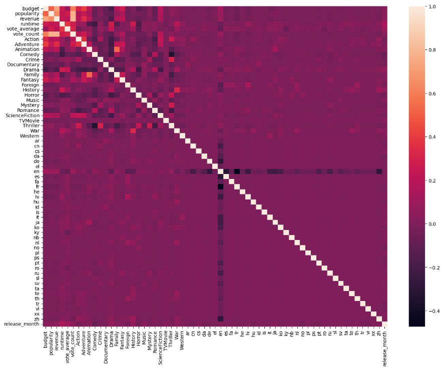
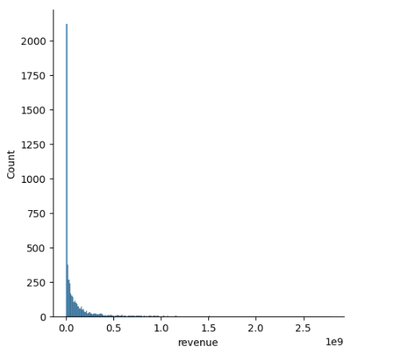
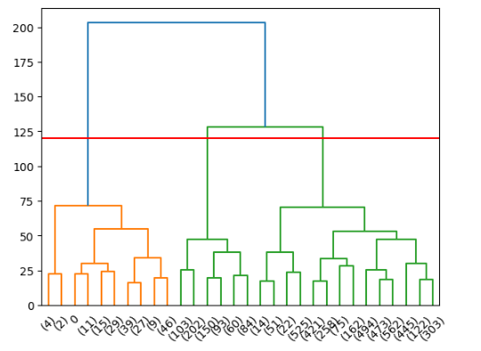
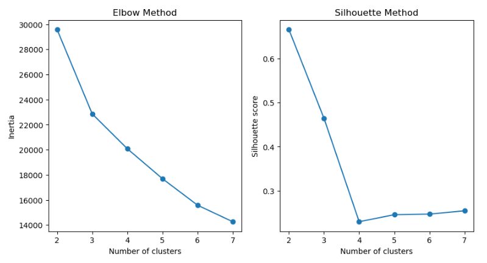
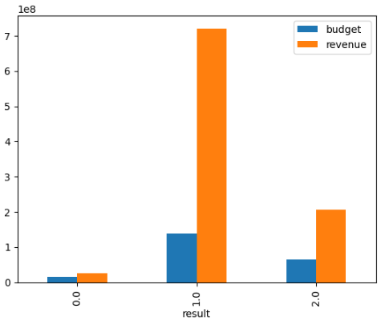

# Clustering movies using KMeans unsupervised learning

Apply an unsupervised learning algorithm in order to cluster similar movies together for a quick EDA

## Authors

Nikolas Margos
<br></br>
https://github.com/NMARGOS
https://www.linkedin.com/in/nikolasmargos/

## Business value/Usage in real life
1. Immediately identify aggregated metrics such as runtime , vote_average, budget, revenue and month of release based on the clusters which allow for a quick insight into ROI based on cluster number.
2. Allow for the identification of movie types belonging to each genre in order to further understand the link between consumer wants, popularity and revenue to create more similar movie types.

## Methodologies used
- PCA
- kmeans
- one hot encoding
- silhouette score
- elbow method
- correlation matrix
- scaling
- hierarchical clustering

## Description

Main goal was to create a clustering model that is capable of identifying similar movies in order to further explore the reasons for their similarities

The file contains the raw code used to identify the ideal cluster size (using methods such as the elbow method and the silhouette score)

## Getting Started

### Dependencies

There is enviroment_listings.yml in the repo with all the necessary dependencies.

### Workflow

A) Read nested json columns and one hot encode them
<br></br>
B) Examine the data to identify correlations and distribution of data for proper scaling
<br></br>
<div align="center">
  <br>
  <sup>Sample display of image in HTML format <sup>
</div>
      <br></br>
<div align="center">
  <br>
  <sup>Sample display of image in HTML format <sup>
</div>
<div align="center">
  <br>
  <sup>Sample display of image in HTML format <sup>
</div>
B) Use PCA to keep enough columns for >90% variability
<br></br>
C) Find the ideal clusters and label the original dataset with the cluster
<br></br>
<div align="center">
  <br>
  <sup>Sample display of image in HTML format <sup>
</div>
<div align="center">
  <br>
  <sup>Sample display of image in HTML format <sup>
</div>      
D) Group the clusters together and observe their aggregated metrix
<div align="center">
  <br>
  <sup>Sample display of image in HTML format <sup>
</div>

### Final Model Choice and Output
A Kmeans model was applied with clusters = 3 since the elbow method, silhouette and hierarchical clustering provided indications for this being the ideal cluster


```python

```
